# Solidity Smart Contracts

 

You will need the below tools to to create and deploy solidity smart contracts:
  - Remix IDE: http://remix.ethereum.org/
  - MetaMask: https://metamask.io
  - Ganache: https://www.trufflesuite.com/ganache

### Background

Your new startup has created its own Ethereum-compatible blockchain to help connect financial institutions, and the team wants to build smart contracts to automate some company finances to make everyone's lives easier, increase transparency, and to make accounting and auditing practically automatic!

Fortunately, you've been learning how to program smart contracts with Solidity! What you will be doing this assignment is creating 3 ProfitSplitter contracts. These contracts will do several things:

 - Pay your Associate-level employees quickly and easily.

 - Distribute profits to different tiers of employees.

 - Distribute company shares for employees in a "deferred equity incentive plan" automatically.

## Level One: The AssociateProfitSplitter Contract

The purpose is to accept Ether from the contract and separate the Ether accordingly to the 3 employees. We will be paying three individuals:
 - Employee 1: employee_one
 - Employee 2: employee_two
 - Employee 3: employee_three

1. First step is to write the contract and get ready to compile. After pressing the "Compile" button, it should show a green checkmark to show that it has succesfully compiled.
 

2. Next, you have to open up the Ganache tool. You must choose or create a new workspace to use and then fund them accordingly. My tool will show 100 ETH with an exception of a couple. 
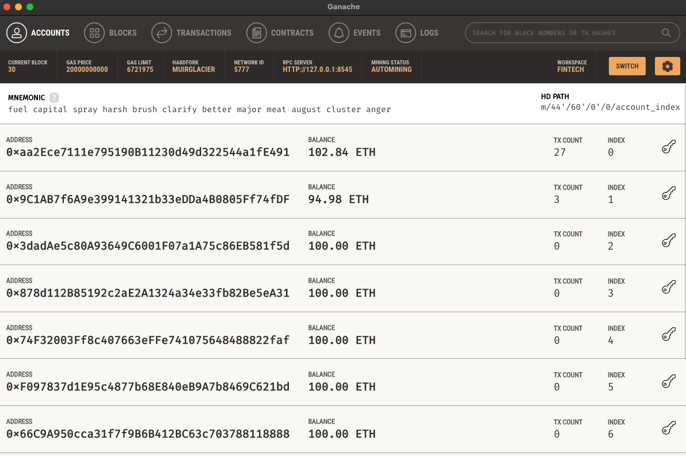 

3. Last step before deploying is connecting your MetaMask and confirming that your Metamask wallet is synergizined with the Remix IDE page. In order to do that, first login to your MetaMask account. Then under Environment, change the dropdown to Injected Web3. That should update with the account you see in MetaMask. 
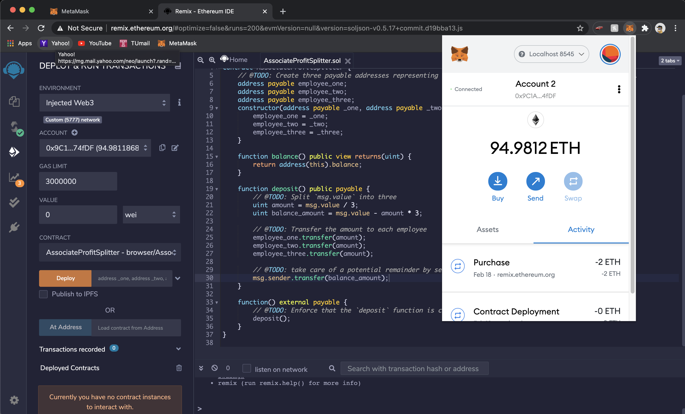 

4. Next you can add any amount in the "Value" section. under deploy you will see options _ONE, _TWO and _THREE. That will represent the 3 employee's wallet addresses. Once you fill them in it should look like this:
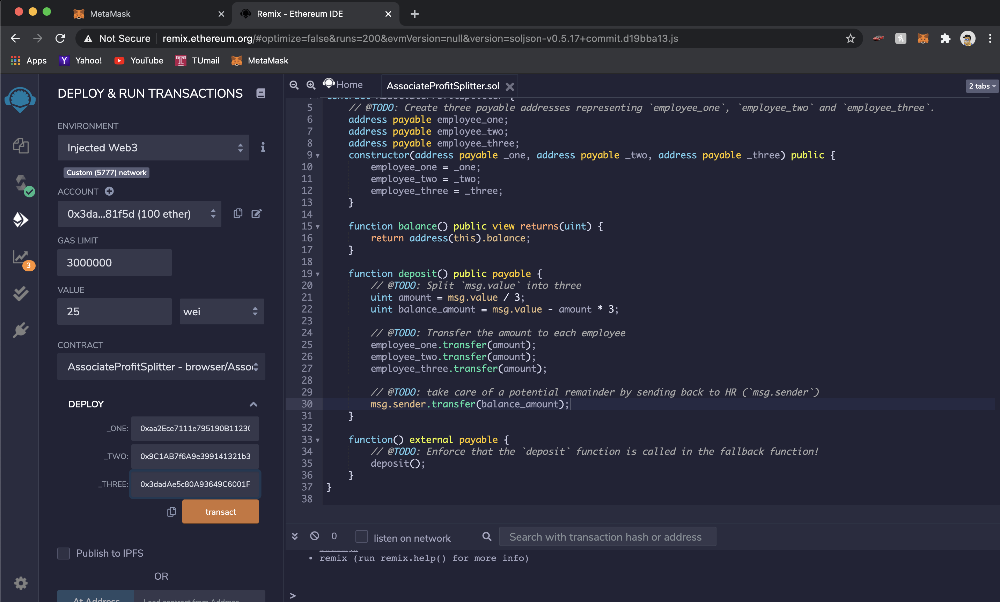 

5. Once you confirm all the information is right, select "transact" and the transaction will appear on MetaMask. You can select "confirm" now.
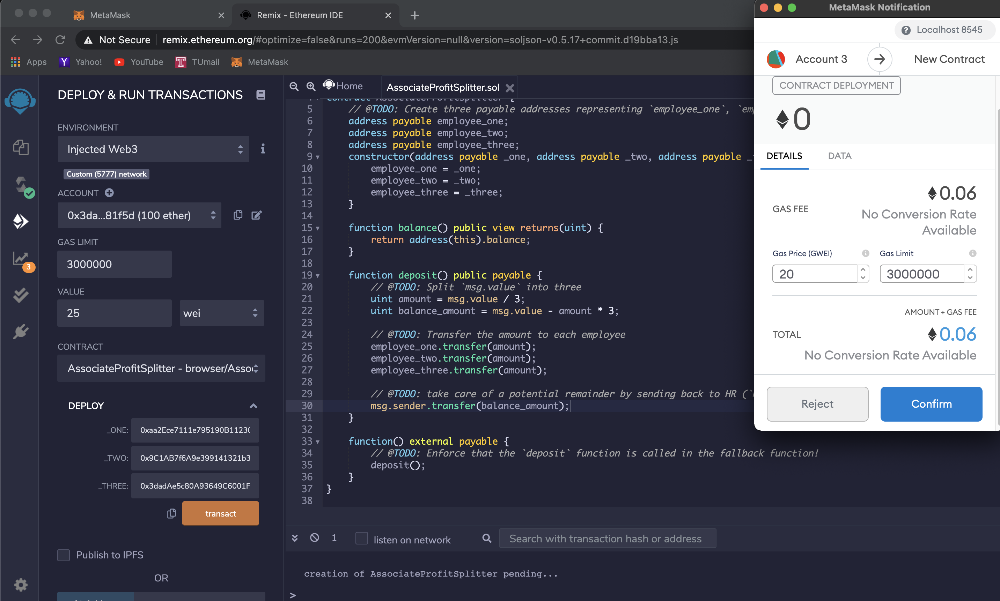 

6. You can confirm the transaction went through by checking the Ganache tool under the "TRANSACTIONS" tab.
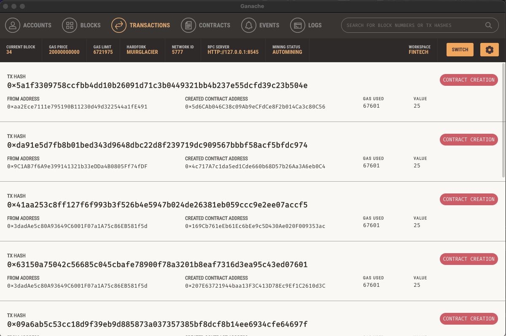 

## Level Two: The TieredProfitSplitter Contract

In this contract, rather than splitting the profits between Associate-level employees, you will calculate rudimentary percentages for different tiers of employees (CEO, CTO, and Bob).

1. Essentially you would conduct the same process as level one. First, you compile if your finished solidity smart contract looks like the following:
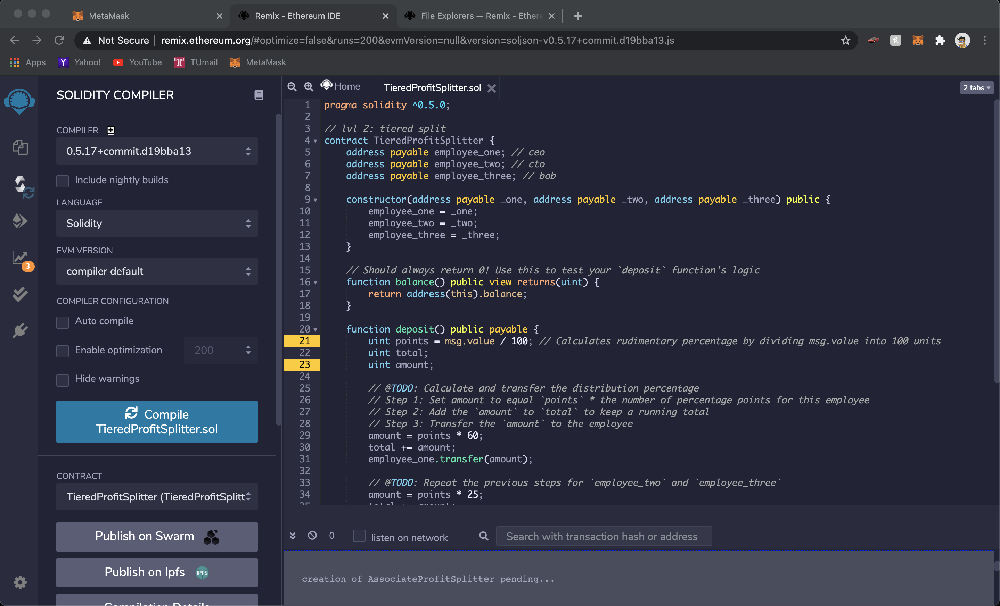 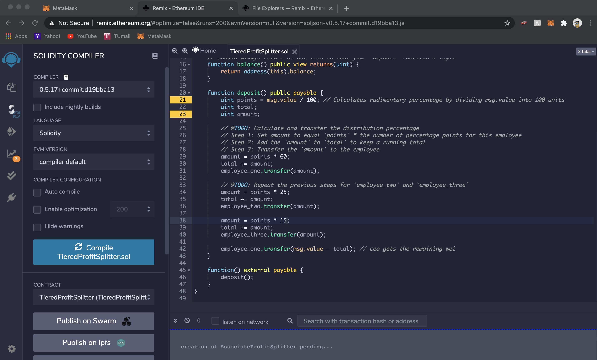 |

You can now hit compile and go to the deploy tab.

2. Same as the level one, change the environment, and add the 3 employee wallets. Then you are ready to Deploy!
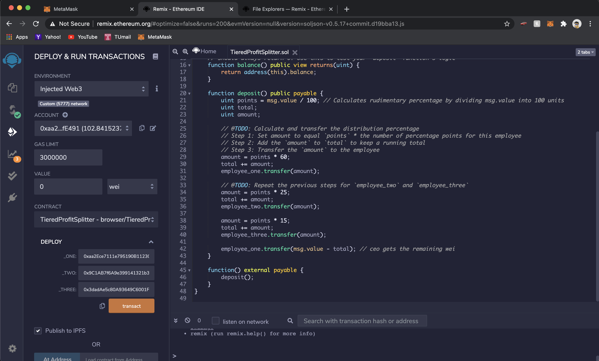

3. Once you hit transact, MetaMask will pop up to confirm your transaction. The contract has Deployed and the transaction has went through.
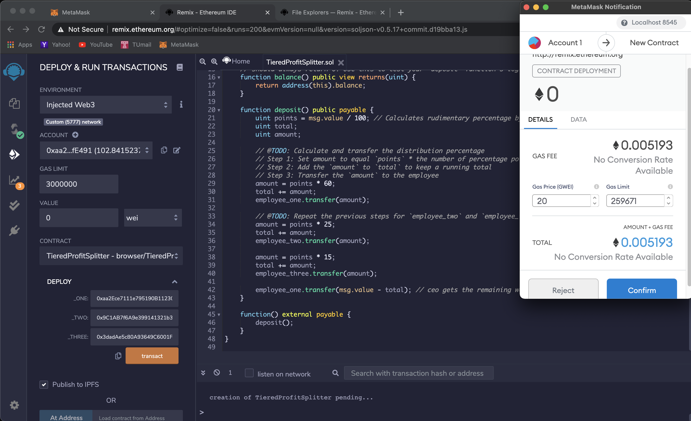

4. Next, you can check Ganache to confirm the transaction generated and successfully completed the transaction.
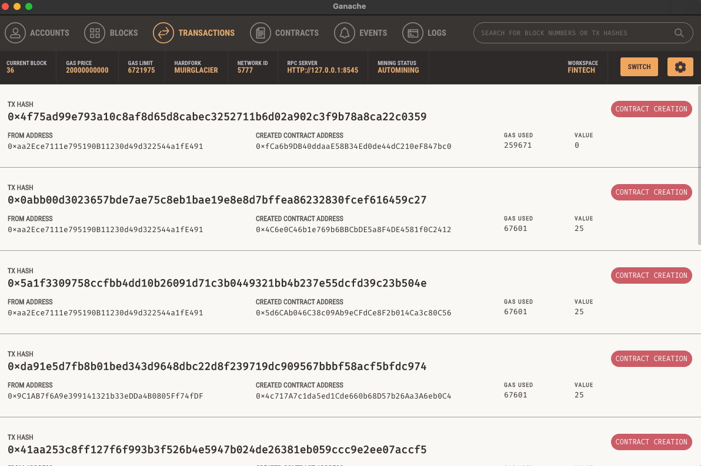

The following is opening up our transaction that we just deployed to see the TXN detail:
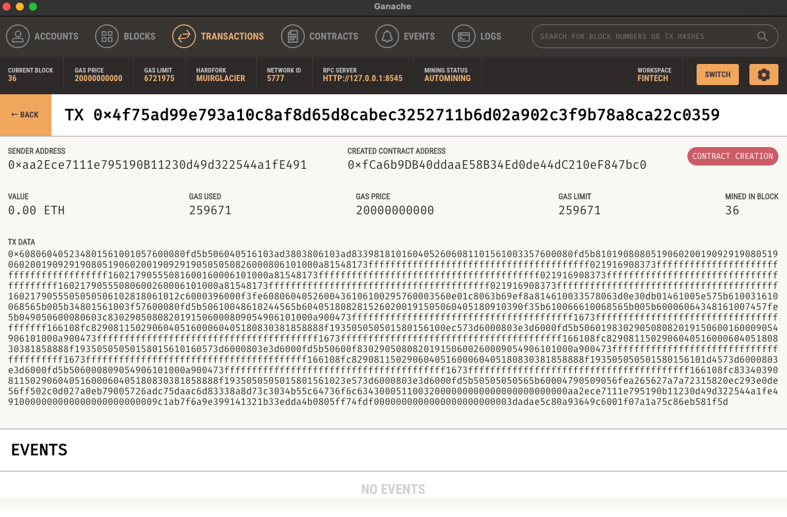

## Level Three: The DeferredEquityPlan Contract
In this contract, we will be managing an employee's "deferred equity incentive plan" in which 1000 shares will be distributed over 4 years to the employee. We won't need to work with Ether in this contract, but we will be storing and setting amounts that represent the number of distributed shares the employee owns and enforcing the vetting periods automatically.

A two-minute primer on deferred equity incentive plans: In this set-up, employees receive shares for joining and staying with the firm. They may receive, for example, an award of 1,000 shares when joining, but with a 4 year vesting period for these shares. This means that these shares would stay with the company, with only 250 shares (1,000/4) actually distributed to and owned by the employee each year. If the employee leaves within the first 4 years, he or she would forfeit ownership of any remaining (“unvested”) shares.

If, for example, the employee only sticks around for the first two years before moving on, the employee’s account will end up with 500 shares (250 shares * 2 years), with the remaining 500 shares staying with the company. In this above example, only half of the shares (and any distributions of company profit associated with them) actually “vested”, or became fully owned by the employee. The remaining half, which were still “deferred” or “unvested”, ended up fully owned by the company since the employee left midway through the incentive/vesting period.

Specific vesting periods, the dollar/crypto value of shares awarded, and the percentage equity stake (the percentage ownership of the company) all tend to vary according to the company, the specialized skills, or seniority of the employee, and the negotiating positions of the employee/company. If you receive an offer from a company offering equity (which is great!), just make sure you can clarify the current dollar value of those shares being offered (based on, perhaps, valuation implied by the most recent outside funding round). In other words, don’t be content with just receiving “X” number of shares without having a credible sense of what amount of dollars that “X” number represents. Be sure to understand your vesting schedule as well, particularly if you think you may not stick around for an extended period of time.

1. The deferred equity plan below shows that the contract will distribute 1,000 company shares for each employee. But the breakdown for the equity plan is an annual distribution of 250 shares each over a 4-year timeframe.

2. Since the original had us write the contract using += 100 days, but the distribution for the shares is on a yearly basis. We have to use a fake now fast forward function that will be +=365 days. 

3. Next, compile the FastForward contract and deploy with 0 wei in "Value" which has a gas fee associated with it.

4. You can check Ganache for the transaction and the TXN detail

5. Next, we need to fast forward the date from today to 1 year. We can do that by first clicking the fastforward button. Confirm on the MetaMask pop up. Once the transaction is successful, you can click the distribute button. Once again confirm on MetaMask pop up. 

6. Finally you can check the Ganache tool for the transaction history and the TXN detail for both to see a successful transaction.

## CONGRATULATIONS!! We have successfully deployed and tested all 3 smart contracts
