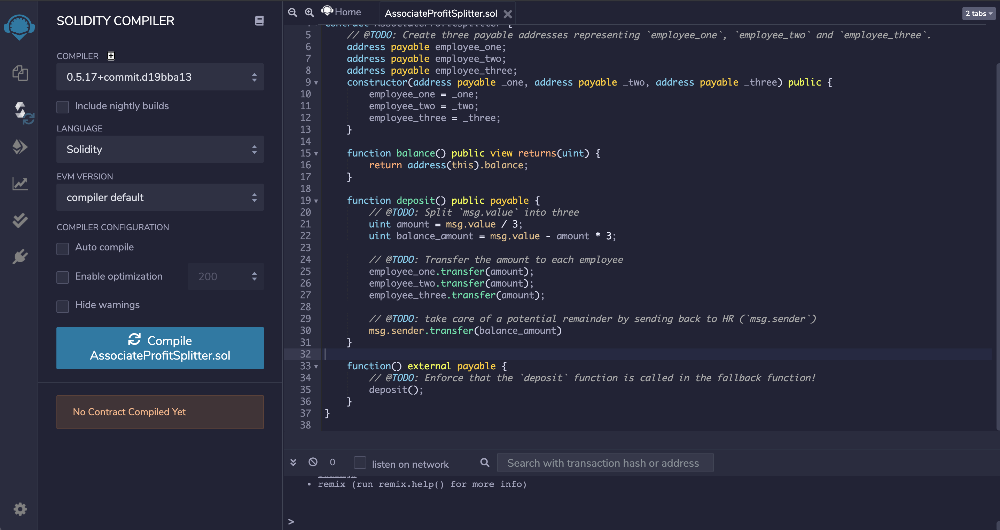

# Solidity Smart Contracts

 

You will need the below tools to to create and deploy solidity smart contracts:
  - Remix IDE: http://remix.ethereum.org/
  - MetaMask: https://metamask.io
  - Ganache: https://www.trufflesuite.com/ganache

### Background

Your new startup has created its own Ethereum-compatible blockchain to help connect financial institutions, and the team wants to build smart contracts to automate some company finances to make everyone's lives easier, increase transparency, and to make accounting and auditing practically automatic!

Fortunately, you've been learning how to program smart contracts with Solidity! What you will be doing this assignment is creating 3 ProfitSplitter contracts. These contracts will do several things:

 - Pay your Associate-level employees quickly and easily.

 - Distribute profits to different tiers of employees.

 - Distribute company shares for employees in a "deferred equity incentive plan" automatically.

## Level One: The AssociateProfitSplitter Contract

The purpose is to accept Ether from the contract and separate the Ether accordingly to the 3 employees. We will be paying three individuals:
 - Employee 1: employee_one
 - Employee 2: employee_two
 - Employee 3: employee_three

1. First step is to write the contract and get ready to compile. After pressing the "Compile" button, it should show a green checkmark to show that it has succesfully compiled.
 

2. Next, you have to open up the Ganache tool. You must choose or create a new workspace to use and then fund them accordingly. My tool will show 100 ETH with an exception of a couple. 
 

3. Last step before deploying is connecting your MetaMask and confirming that your Metamask wallet is synergizined with the Remix IDE page. In order to do that, first login to your MetaMask account. Then under Environment, change the dropdown to Injected Web3. That should update with the account you see in MetaMask. 
 

4. Next you can add any amount in the "Value" section. under deploy you will see options _ONE, _TWO and _THREE. That will represent the 3 employee's wallet addresses. Once you fill them in it should look like this:
 

5. Once you confirm all the information is right, select "transact" and the transaction will appear on MetaMask. You can select "confirm" now.
 

6. You can confirm the transaction went through by checking the Ganache tool under the "TRANSACTIONS" tab.
 

## Level Two: The TieredProfitSplitter Contract

In this contract, rather than splitting the profits between Associate-level employees, you will calculate rudimentary percentages for different tiers of employees (CEO, CTO, and Bob).

1. Essentially you would conduct the same process as level one. First, you compile if your finished solidity smart contract looks like the following:

You can now hit compile and go to the deploy tab.

2. Same as the level one, change the environment, and add the 3 employee wallets. Then you are ready to Deploy!

3. Once you hit transact, MetaMask will pop up to confirm your transaction. The contract has Deployed and the transaction has went through.

4. Next, you can check Ganache to confirm the transaction generated and successfully completed the transaction.

The following is opening up our transaction that we just deployed to see the TXN detail:
